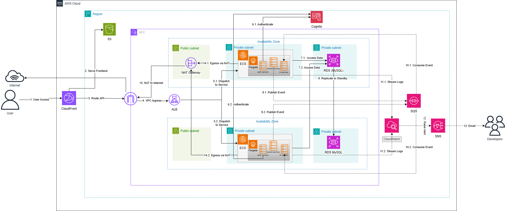

---
title: "Tổng quan & Kiến trúc"
date: 2026-07-08
weight: 1
chapter: false
pre: " <b> 5.1. </b> "
---

## 1. Ý tưởng & Mục tiêu

#### Bối cảnh & Vấn đề
<!-- TODO: viết thêm -->
Các doanh nghiệp vừa và nhỏ (SME) cần hệ thống quản lý nhân sự (nhân viên, phòng ban, dữ liệu lương) nhưng không muốn tự vận hành và bảo trì máy chủ. Một hệ SaaS dùng chung phải bảo đảm dữ liệu của mỗi công ty được cách ly tuyệt đối.

#### Khách hàng mục tiêu
Các công ty SME thuê SaaS để quản lý nhân sự. **Mỗi công ty = một tenant riêng biệt** (cách ly dữ liệu theo `tenant_id` ở từng request).

#### Mục tiêu
- Cung cấp SaaS HR đa khách hàng trên AWS với cách ly dữ liệu theo tenant.
- Tính sẵn sàng cao (Multi-AZ) và tầng ứng dụng co giãn ngang.
- Dùng dịch vụ managed, ít vận hành (không tự quản máy chủ).

#### Tiêu chí thành công
- Chạy được end-to-end: đăng nhập → gọi API có xác thực → đọc/ghi dữ liệu.
- Sự kiện bất đồng bộ (tenant → HR) được chuyển qua SQS.
- Trụ được khi hỏng 1 AZ / RDS (Multi-AZ failover).
- Chi phí ~\$130/tháng (24/7), gần \$0 khi tắt stack.

#### Phù hợp với chương trình
Use-case AWS thực tế dùng **≥3 dịch vụ managed** — bao trùm compute, dữ liệu, danh tính, messaging, edge và giám sát.

---

## 2. Mô tả kiến trúc

#### Sơ đồ kiến trúc

Ba tầng trong một VPC, trải trên hai Availability Zone:
- **Trình bày:** CloudFront (edge) → S3 (static riêng tư, OAC).
- **Ứng dụng:** ALB (public) → ECS Fargate (private) chạy `auth` / `tenant` / `hr`.
- **Dữ liệu:** RDS MySQL Multi-AZ (private). Bất đồng bộ qua SQS; xác thực bằng JWT RS256 tự ký.

#### Các dịch vụ AWS sử dụng
| Tầng | Dịch vụ | Vai trò |
|:--|:--|:--|
| Edge | CloudFront | CDN + cổng vào duy nhất (static + API) |
| Static | S3 (riêng tư + OAC) | Bản build React |
| Danh tính | JWT RS256 tự ký | auth-service ký JWT (claim `tenant_id` + role); tenant/hr verify bằng public key. Cognito pool đã dựng nhưng không đưa vào flow. |
| Cân bằng tải | Application Load Balancer | Định tuyến `/api/v1/*` tới ECS |
| Compute | ECS Fargate (3 service) | Microservice auth / tenant / hr |
| Registry | ECR | Image container |
| CSDL | RDS MySQL `db.t4g.micro` Multi-AZ | Primary + Standby, 3 DB logic |
| Bất đồng bộ | SQS (+ DLQ) | tenant → queue → hr |
| Secret | SSM Parameter Store | Mật khẩu DB, URL SQS, khóa JWT, ID Cognito |
| Giám sát | CloudWatch + SNS | Log + alarm CPU → email |
| Mạng | VPC, IGW, 1 NAT Gateway | 6 subnet / 2 AZ |

#### Lý do chọn dịch vụ
| Dịch vụ | Lý do chọn |
|:--|:--|
| **ECS Fargate** | Container serverless — không phải vá/scale EC2; hỗ trợ auto scaling sẵn. |
| **RDS Multi-AZ** | CSDL managed HA, standby đồng bộ + tự failover + backup. |
| **SQS** | Tách rời tenant→hr, hấp thụ tải đột biến, sống sót khi consumer chết; DLQ bắt message lỗi; không phải tự chạy broker. |
| **JWT RS256 tự ký** | auth-service = nơi phát duy nhất (private key); tenant/hr = verifier stateless (public key). Không chia sẻ secret, không phụ thuộc IdP ngoài. (Cognito pool đã dựng nhưng không nằm trong flow.) |
| **CloudFront + S3** | Host static rẻ, cache tại edge; S3 vẫn riêng tư nhờ OAC. |
| **ALB** | Định tuyến L7 theo path tới 3 service + health check. |
| **SSM Parameter Store** | Secret SecureString miễn phí — không hard-code key trong image. |

