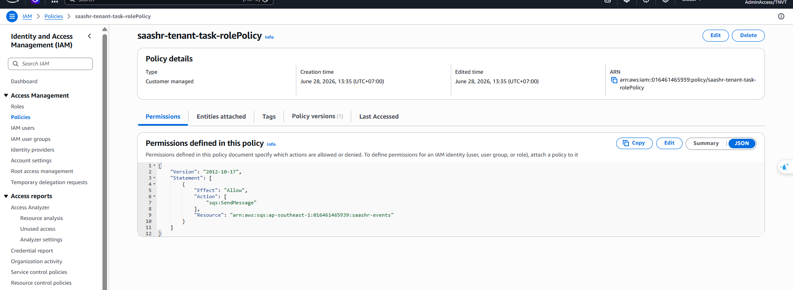
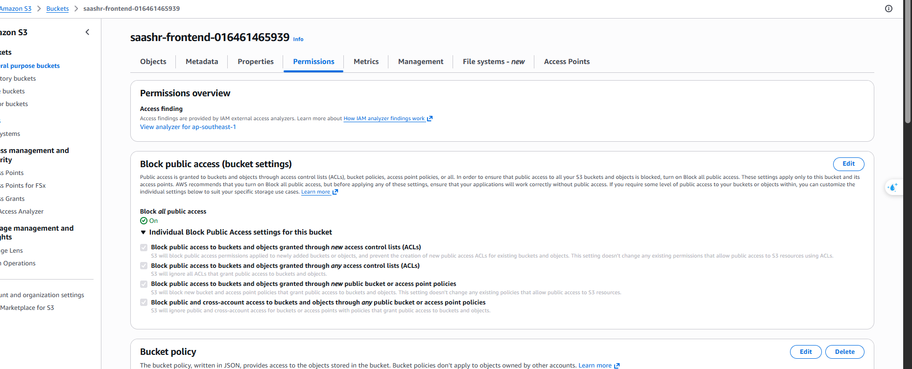
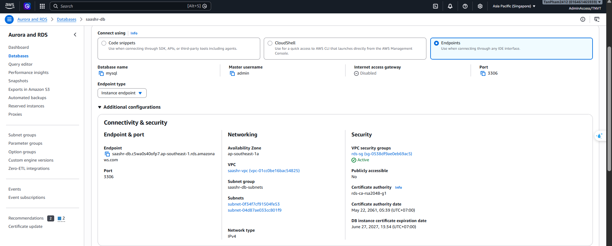

---
title: "Bảo mật & IAM"
date: 2026-07-08
weight: 10
chapter: false
pre: " <b> 5.10. </b> "
---

Cách thiết kế áp dụng quyền tối thiểu, giữ tài nguyên riêng tư, và tránh hard-code thông tin đăng nhập.

## Nguyên tắc quyền tối thiểu (Least Privilege)

Mỗi ECS service dùng **task role** riêng, chỉ có đúng những action cần thiết:

| Service | Action được phép |
|:--|:--|
| `tenant` | `sqs:SendMessage` trên `saashr-events` |
| `hr` | `sqs:ReceiveMessage`, `sqs:DeleteMessage` trên `saashr-events` |
| `auth` | `cognito-idp` tối thiểu (InitiateAuth), `ssm:GetParameters` |
| tất cả | `ssm:GetParameters` (param của mình), ghi CloudWatch Logs |

Ví dụ — task role của `tenant` (giới hạn 1 queue, 1 action):
```json
{
  "Version": "2012-10-17",
  "Statement": [{
    "Effect": "Allow",
    "Action": "sqs:SendMessage",
    "Resource": "arn:aws:sqs:ap-southeast-1:<acct>:saashr-events"
  }]
}
```

Task role với policy least-privilege inline → 


## Không hard-code thông tin đăng nhập
- boto3 dùng **credential từ ECS task-role** lúc runtime — **không có static access key** trong code hay image.
- Secret (mật khẩu DB, URL SQS, ID Cognito) lấy từ **SSM Parameter Store** khi task khởi động, không nằm trong repo.

## Riêng tư mặc định
- **ECS** và **RDS** chạy trong **private subnet**, **không có public IP**.
- **S3** chặn mọi truy cập public; chỉ phục vụ qua **CloudFront OAC**.
- Subnet dữ liệu của **RDS** **không có route ra internet**.

## Security group zero-trust
`sg-alb` → `sg-ecs` → `sg-rds` nối chuỗi để mỗi tầng chỉ nhận traffic từ tầng phía trước (xem [Mạng](../5.3-Networking/)). Database không thể tiếp cận từ internet.

> 📷 **[Ảnh]** S3 "Block all public access = On" + RDS "Publicly accessible = No" → `/images/5-Workshop/5.10-Security-IAM/private-resources.png`




