---
title: "Mạng"
date: 2026-07-08
weight: 3
chapter: false
pre: " <b> 5.3. </b> "
---

Xây nền tảng mạng trước: một VPC, 6 subnet trên 2 AZ, một Internet Gateway, một NAT Gateway, và các security group.

## Bước 1 — VPC + 6 Subnet + IGW + NAT

1. **VPC → Create VPC** — tên `saashr-vpc`, CIDR `10.0.0.0/16`.

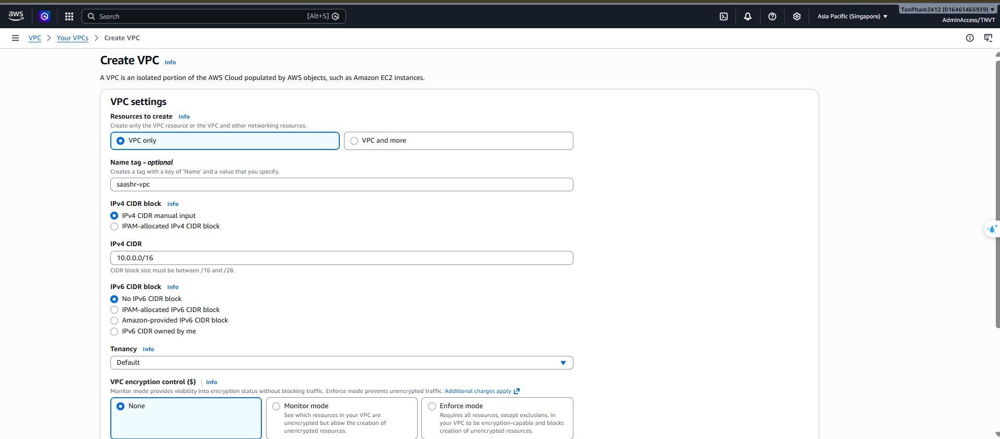

- VPC -> VPC đã tạo

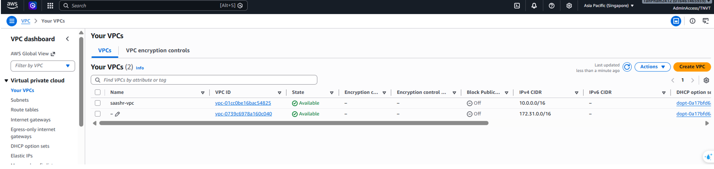
2. **Subnets** — tạo 6 cái:

| Tên subnet | AZ | CIDR | Mục đích |
|:--|:--|:--|:--|
| `public-1a` | 1a | `10.0.1.0/24` | ALB, NAT |
| `public-1b` | 1b | `10.0.2.0/24` | ALB |
| `app-1a` | 1a | `10.0.11.0/24` | ECS Fargate |
| `app-1b` | 1b | `10.0.12.0/24` | ECS Fargate |
| `data-1a` | 1a | `10.0.21.0/24` | RDS Primary |
| `data-1b` | 1b | `10.0.22.0/24` | RDS Standby |

- VPC -> Subnets -> Create Subnet
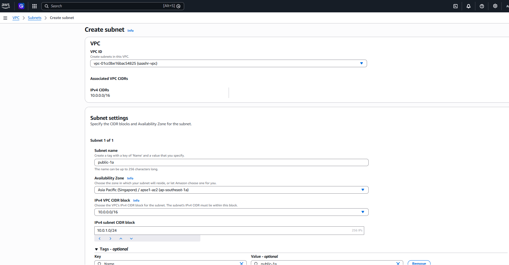

- Tạo thành công 6 subnet
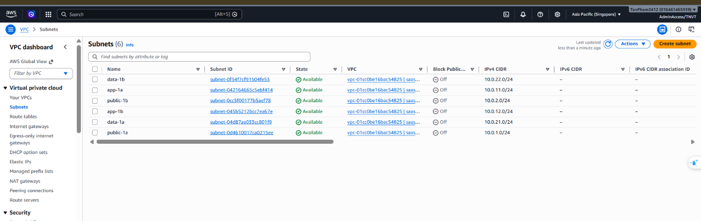

3. **Internet Gateway** — tạo `saashr-igw`, **gắn vào VPC**.
- VPC -> Internet gateway -> create internet gateway
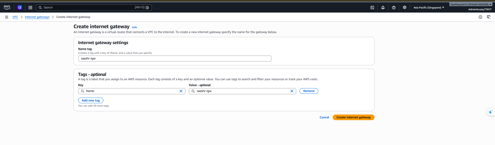

- Actions -> Attach to VPC
4. **NAT Gateway** — tạo **1** cái trong `public-1a`, cấp một Elastic IP.
- Choose VPC -> Elastic IP addresses -> Allocate Elastic IP Address
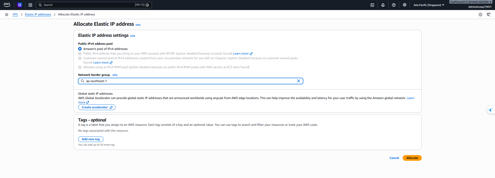

- Bấm Allocate

- Click VPC -> NAT gateway -> Create NAT gateway
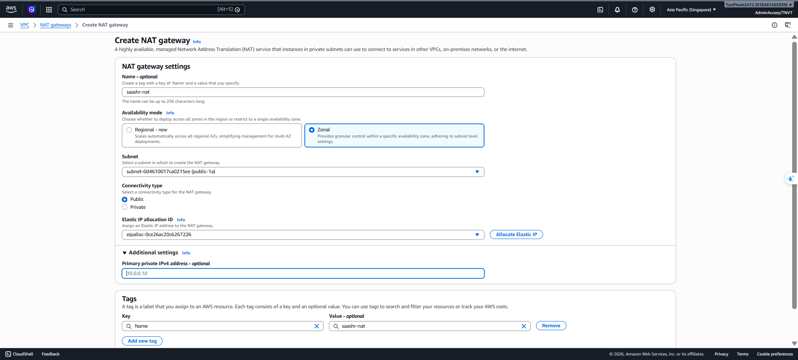
- Tạo hoàn tất
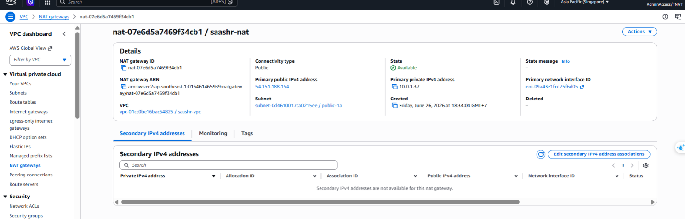
5. **Route table:**
   - `rt-public` → `0.0.0.0/0` → **IGW** → gắn `public-1a`, `public-1b`.
   - `rt-app` → `0.0.0.0/0` → **NAT Gateway** → gắn `app-1a`, `app-1b`.
   - `rt-data` → **không có route internet** (chỉ local) → gắn `data-1a`, `data-1b`.

- Click VPC -> route table -> create route table
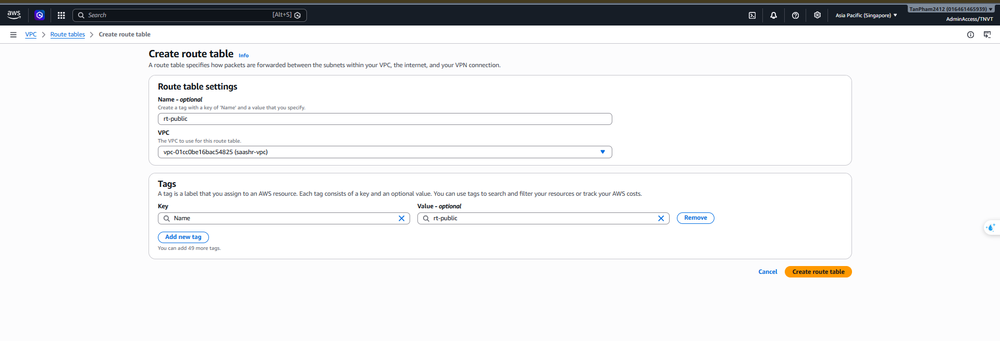

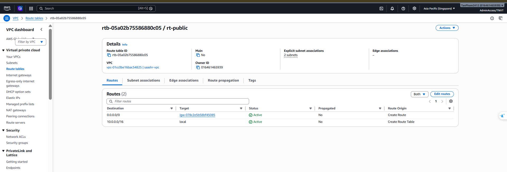

- Click Actions -> Edit subnet associations
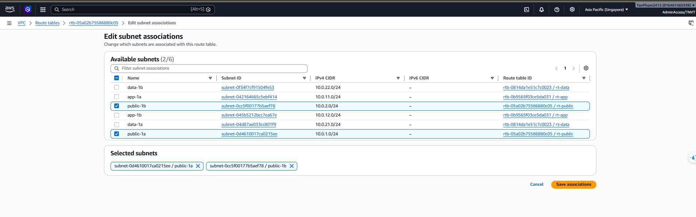

- Click Edit routes
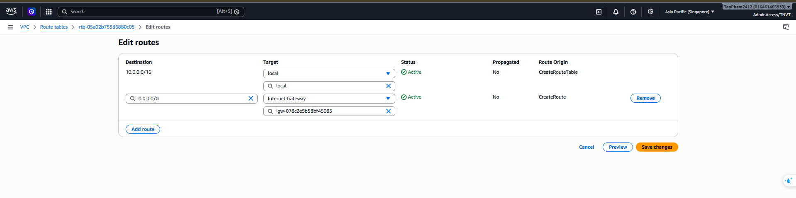
- Tạo thành công 3 route table

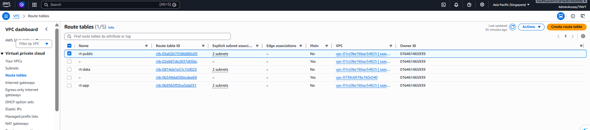

## Bước 2 — Security Group (zero-trust)

| SG | Ingress | Egress |
|:--|:--|:--|
| **`sg-alb`** | 80/443 từ `0.0.0.0/0` | tất cả |
| **`sg-ecs`** | cổng app (8000–8002) **chỉ từ `sg-alb`** | tất cả (NAT → Cognito/SQS/ECR/CloudWatch) |
| **`sg-rds`** | 3306 **chỉ từ `sg-ecs`** | không |

3 security group

- ALB security group inbound và outbound
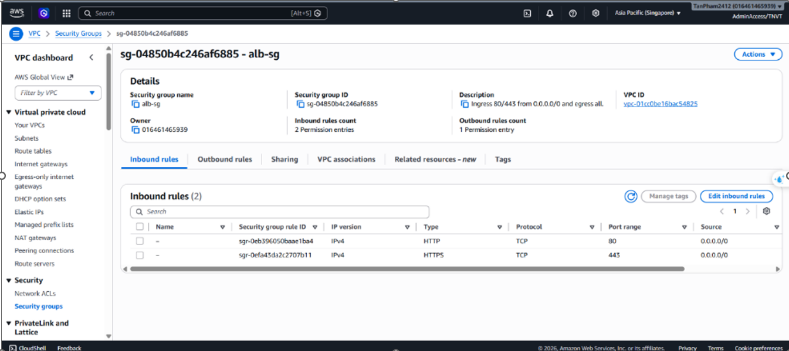
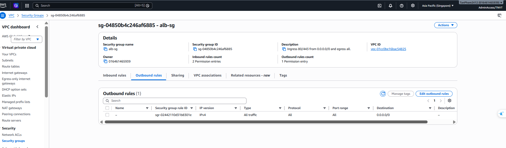

- ECS security group inbound và outbound
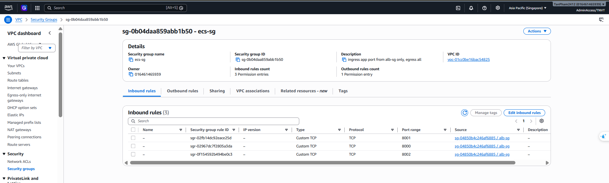
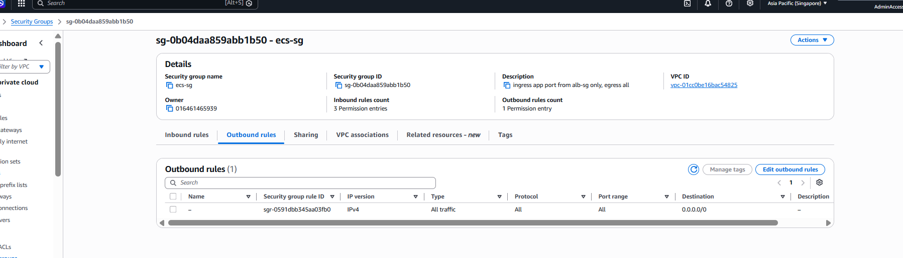

- RDS security group inbound và outbound
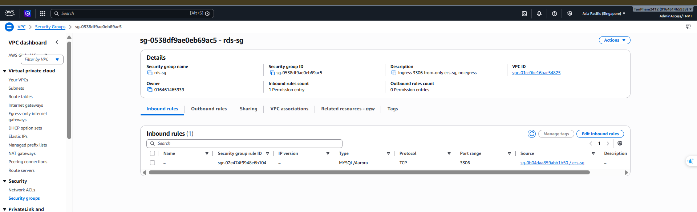
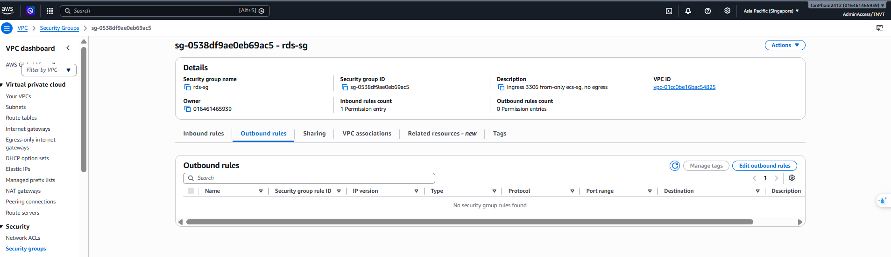

{}
Các SG nối chuỗi (alb → ecs → rds) khiến database không bao giờ tiếp cận được từ internet — chỉ từ các ECS task. Xem [Bảo mật & IAM](../5.10-Security-IAM/).
{}

