---
title: "Dữ liệu & Danh tính"
date: 2026-07-08
weight: 4
chapter: false
pre: " <b> 5.4. </b> "
---

Tầng dữ liệu (RDS), kho secret (SSM), và phần danh tính (Cognito pool + khóa JWT RS256 của ứng dụng).

## Bước 3 — RDS MySQL Multi-AZ

1. **RDS → Subnet groups** → `saashr-db-subnets` = `data-1a` + `data-1b`.
2. **Create database** → MySQL → `db.t4g.micro` → **Multi-AZ: Yes (create a standby)**.
- Search Aurora and RDS -> Databases -> Click Create Database -> Choose Full Configuration
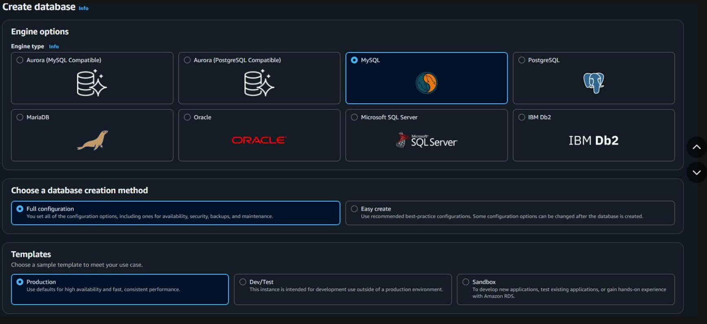
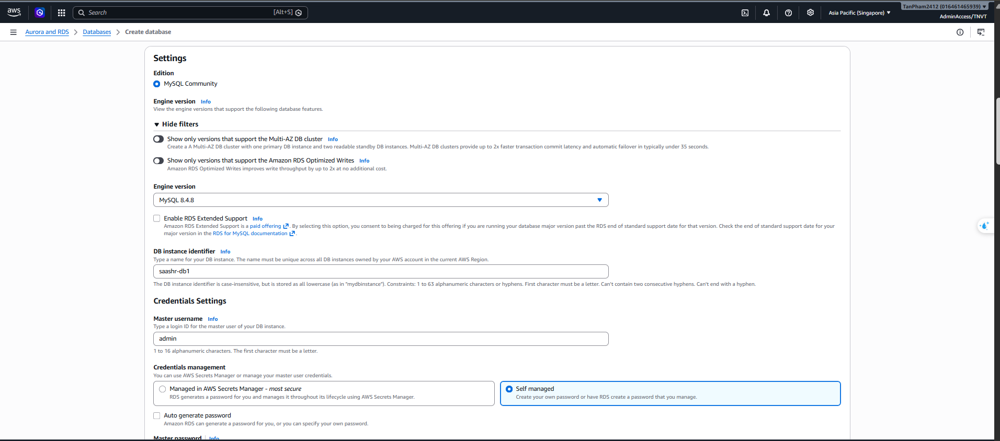

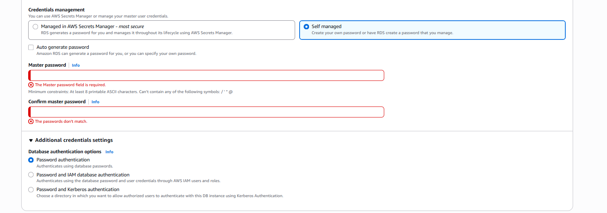
3. Storage type: gp3; Storage 20 GB gp3; Enable Storage Autoscaling: bỏ tick.
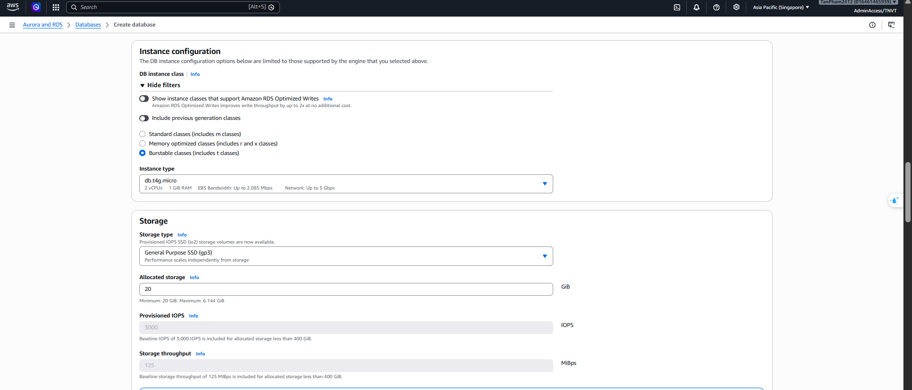
4. VPC = `saashr-vpc`, subnet group = `saashr-db-subnets`, **Public access = No**, SG = `sg-rds`.
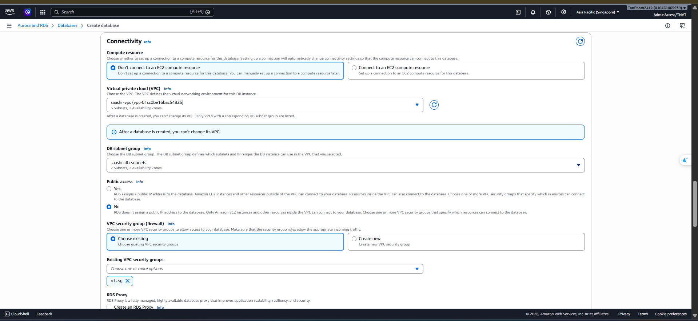
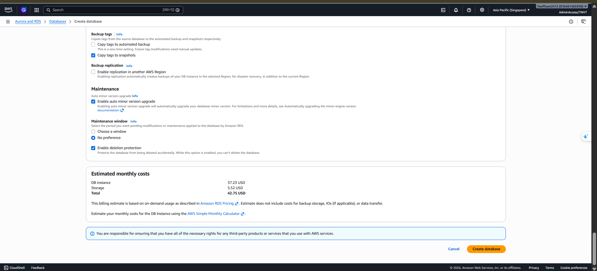

- Tạo database thành công
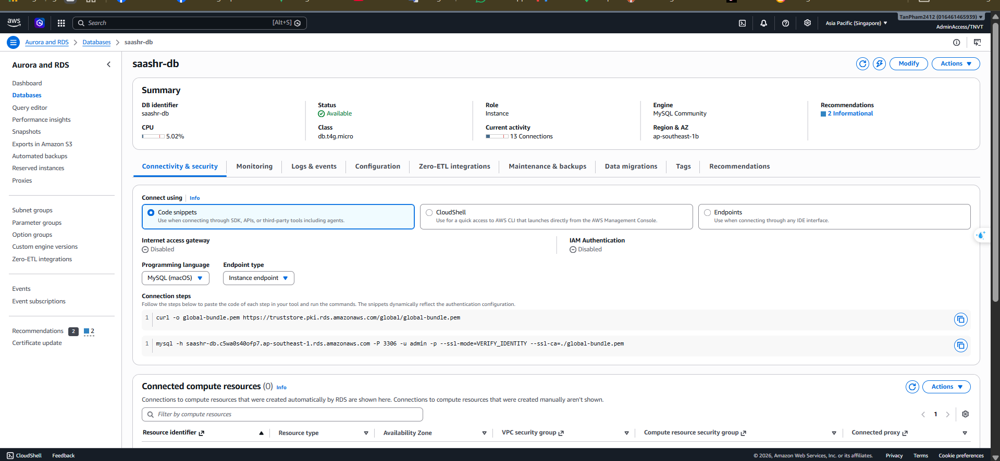
5. Tạo xong, chạy `database/init.sql` để tạo `auth_db`, `tenant_db`, `hr_db` (qua bastion tạm).
    - tạo ec2
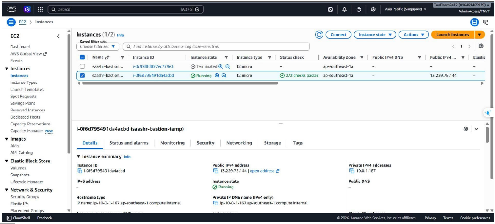
    - Đưa file init.sql vào ec2
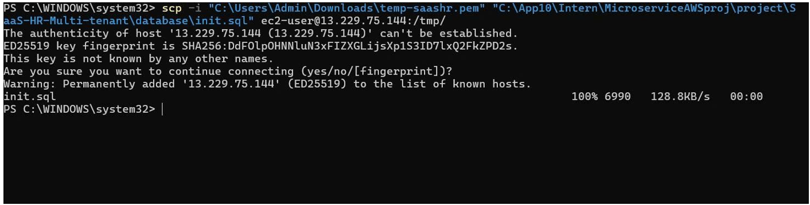

    - Kết nối ec2 tới database
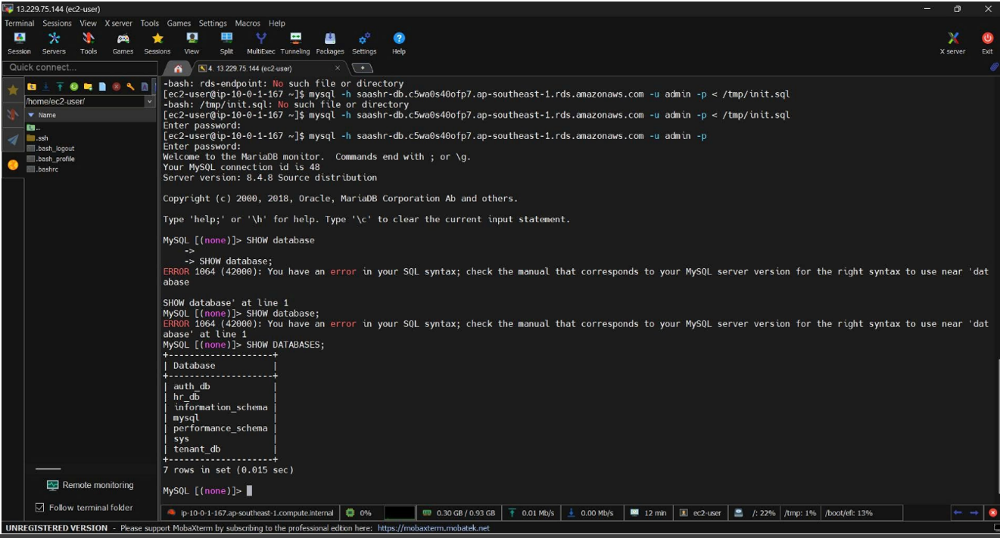


> 📎 **Đính kèm:** `database/init.sql` (đặt vào `5.4-Data-Identity/files/`).

## Bước 4 — Secret (SSM Parameter Store)

Lưu cấu hình và secret trong **Systems Manager → Parameter Store** dạng **SecureString** (miễn phí), sau đó được ECS task definition tham chiếu — không hard-code gì trong image.

1. Tìm và mở **Systems Manager → Parameter Store**.
2. Bấm **Create parameter**.

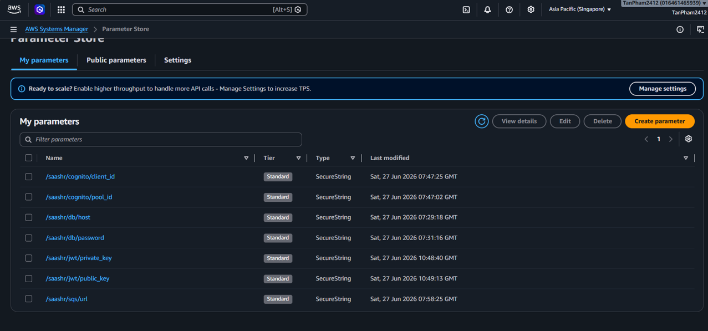
3. Với mỗi parameter dưới đây: nhập **Name**, đặt **Type = SecureString**, dán **Value**, rồi **Create parameter**. Lặp lại cho cả 7 cái.
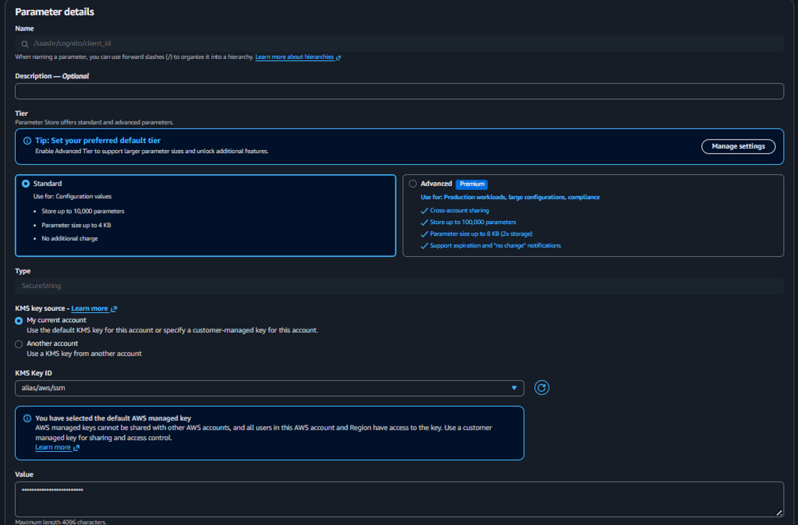
| Tên parameter | Chứa |
|:--|:--|
| `/saashr/cognito/client_id` | Cognito app client ID |
| `/saashr/cognito/pool_id` | Cognito user pool ID |
| `/saashr/db/host` | RDS endpoint (host) |
| `/saashr/db/password` | Mật khẩu database RDS |
| `/saashr/jwt/private_key` | Private key ký JWT RS256 |
| `/saashr/jwt/public_key` | Public key verify JWT RS256 |
| `/saashr/sqs/url` | URL hàng đợi SQS |

- Trên AWS Console -> bấm Cloudshell ở dưới cùng -> dán lệnh này để lấy private key và public key
#### Sinh cặp khóa JWT RS256
`/saashr/jwt/private_key` và `/saashr/jwt/public_key` là một cặp khóa RSA. Sinh một lần trong **AWS CloudShell**, rồi dán output PEM vào 2 parameter SecureString ở trên:

```python
python3 -c "
from cryptography.hazmat.primitives.asymmetric import rsa
from cryptography.hazmat.primitives import serialization

key = rsa.generate_private_key(public_exponent=65537, key_size=2048)

priv = key.private_bytes(serialization.Encoding.PEM, serialization.PrivateFormat.TraditionalOpenSSL, serialization.NoEncryption()).decode()
pub = key.public_key().public_bytes(serialization.Encoding.PEM, serialization.PublicFormat.SubjectPublicKeyInfo).decode()

print('=== PRIVATE KEY ===')
print(priv)
print('=== PUBLIC KEY ===')
print(pub)
"
```

> ⚠️ **Không bao giờ publish private key thật.** Chỉ show lệnh này — che key được in ra và mask giá trị `/saashr/jwt/private_key` trong mọi ảnh. Ai giữ private key là giả mạo được JWT của toàn hệ thống.

{}
`db/password` và `jwt/private_key` bắt buộc là **SecureString**. Cùng giá trị đó có thể đặt bằng CLI, ví dụ `aws ssm put-parameter --name "/saashr/db/host" --type SecureString --value "<rds-endpoint>"`.
{}


## Bước 5 — Cognito

1. Tìm và mở **Cognito → User pools**.

2. Bấm **Create user pool** và cấu hình:
   - **Application type:** Traditional web application
   - **Name your application:** `saashr-app`
   - **Sign-in identifiers:** Email
   - **Self-registration:** Enable self-registration
   - **Return URL:** `https://localhost` (dev; production dùng URL CloudFront)

   Rồi bấm **Create user directory** để tạo pool.


3. Mở user pool vừa tạo → **App clients**.
4. Bấm **Create app client**:
   - **Application type:** Traditional web application
   - **Name your application:** `saashr-app`
   - **Return URL:** `https://localhost`

   Rồi bấm **Create app client** để hoàn tất.


5. Ghi lại **User pool ID** và **App client ID** → lưu vào SSM là `/saashr/cognito/pool_id` và `/saashr/cognito/client_id` (Bước 4).

{}
Pool này cung cấp **thư mục user và đăng nhập**. Cách ly tenant (`tenant_id`) và role được mang trong **JWT RS256** của ứng dụng (khóa từ Bước 4).
{}


