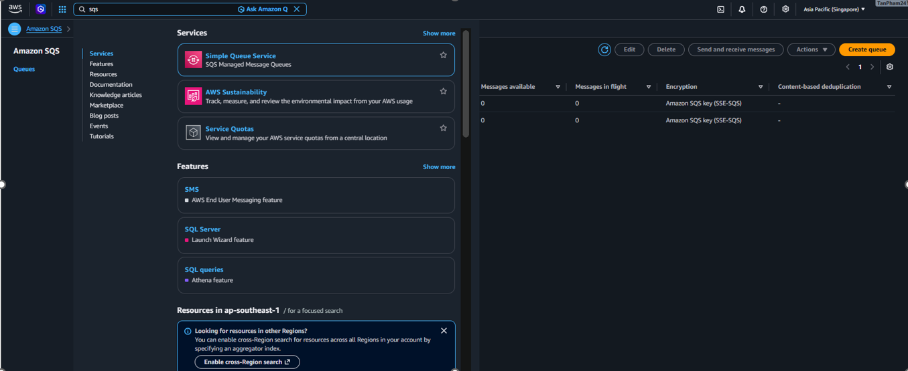
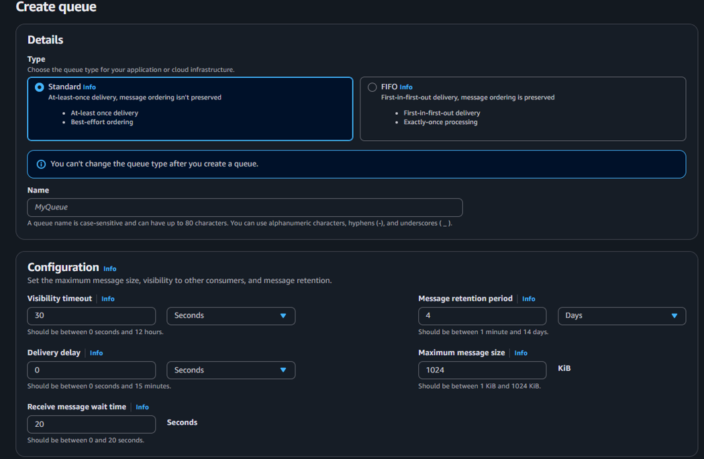
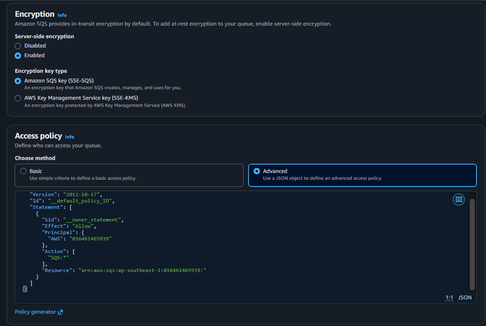
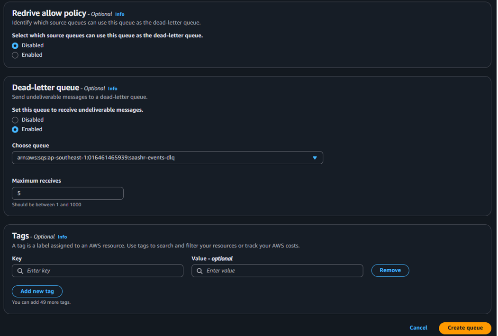
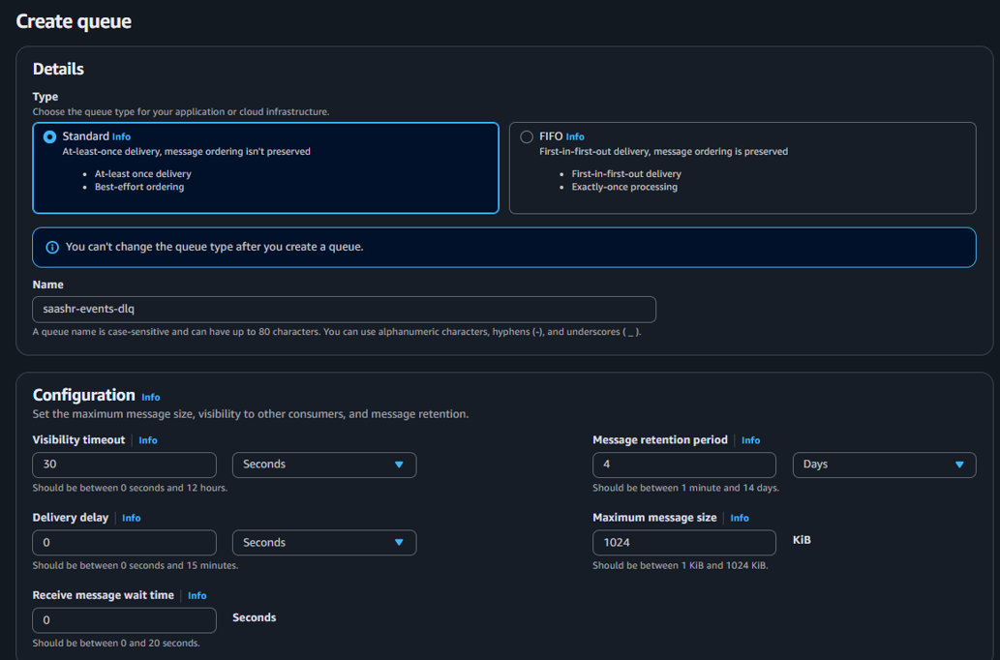
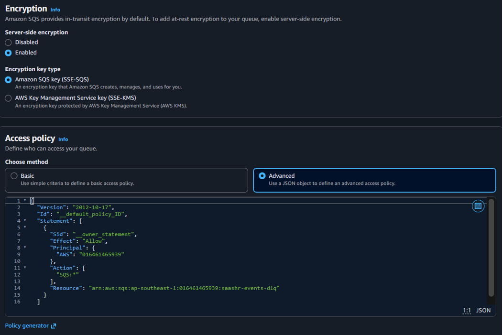
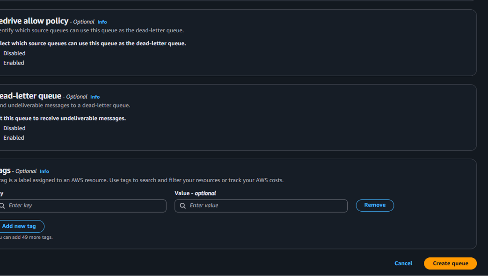

---
title: "Hàng đợi bất đồng bộ (SQS)"
date: 2026-07-08
weight: 5
chapter: false
pre: " <b> 5.5. </b> "
---

`tenant-service` phát sự kiện nghiệp vụ; `hr-service` tiêu thụ bất đồng bộ. Hàng đợi tách rời hai bên và hấp thụ tải đột biến; Dead-Letter Queue bắt các message lỗi.

## Bước 6 — SQS + DLQ

1. Tìm và mở **Simple Queue Service → Queues**.



2. **Tạo hàng đợi chính `saashr-events`:**
   - **Type:** Standard
   - **Name:** `saashr-events`
   - Giữ cấu hình mặc định, chỉ đổi **Receive message wait time = 20** (bật long-polling — khớp với consumer).
   - **Access policy:** Advanced
   - **Dead-letter queue** → *"Set this queue to receive undeliverable messages"* = **Enabled**
     - **Choose queue:** `arn:aws:sqs:ap-southeast-1:<account-id>:saashr-events-dlq`
     - **Maximum receives:** `5`
   - Bấm **Create queue**.




3. **Tạo hàng đợi dead-letter `saashr-events-dlq`:**
   - **Type:** Standard
   - **Name:** `saashr-events-dlq`
   - **Access policy:** Advanced
   - Bấm **Create queue**.




4. Ghi lại **Queue URL của `saashr-events`** → lưu vào SSM là `/saashr/sqs/url` (Bước 4).

{}
Console chỉ cho chọn DLQ **đã tồn tại**. Vì vậy hãy tạo `saashr-events-dlq` trước, rồi mới bật redrive policy trên `saashr-events`.
{}

#### Code ứng dụng (đã hiện thực)
Bên phát — `tenant-service/app/core/sqs.py` (boto3, dùng credential từ ECS task-role, không có static key):
```python
# send_message(QueueUrl=SQS_QUEUE_URL, MessageBody=json.dumps(event))
```
Bên tiêu thụ — `hr-service/app/core/worker.py` (`start_sqs_consumer`): long-poll → xử lý → `delete_message` khi thành công (lỗi thì retry, rồi rơi vào DLQ).

> 📎 **Đính kèm:** `sqs.py`, `worker.py` (đặt vào `5.5-Async-SQS/files/`).

{}
Tách rời hướng sự kiện qua SQS chính là điểm co giãn cho luồng bất đồng bộ — xem thêm [Bảo mật & IAM](../5.10-Security-IAM/) cho quyền SQS của task-role.
{}


