---
title: "Frontend & CDN"
date: 2026-07-08
weight: 7
chapter: false
pre: " <b> 5.7. </b> "
---

Host bản build React riêng tư trên S3 và phục vụ mọi thứ qua CloudFront (một cổng vào cho static + API).

## Bước 11 — S3 (Static) + build frontend

1. **S3 → Create bucket** `saashr-frontend-<acct>`, **Block all public access = ON** (chỉ phục vụ qua CloudFront OAC).
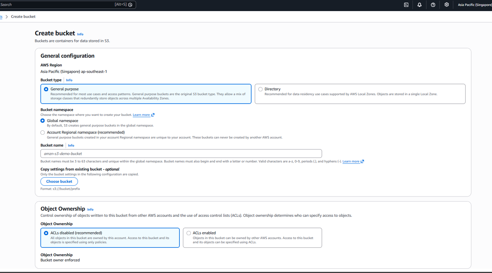
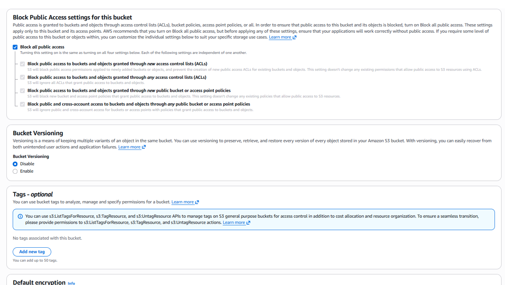
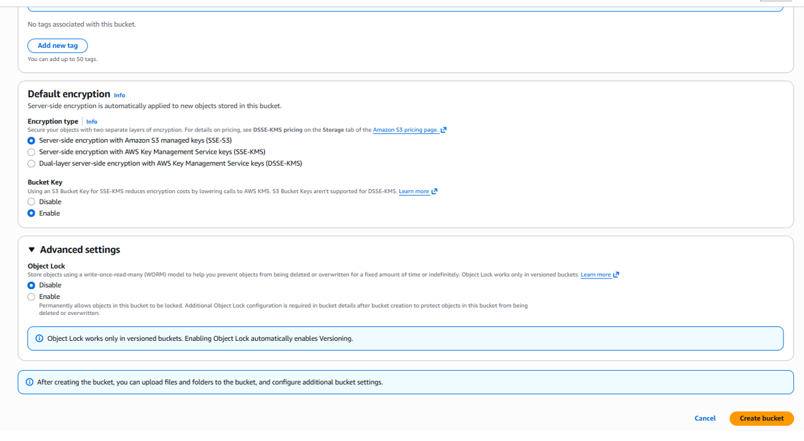
2. Build và upload:
```bash
cd frontend
npm run build
aws s3 sync dist/ s3://saashr-frontend-<acct> --delete
```
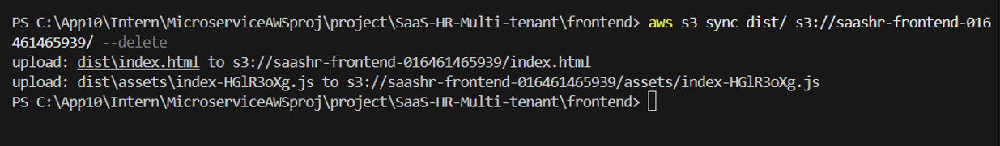

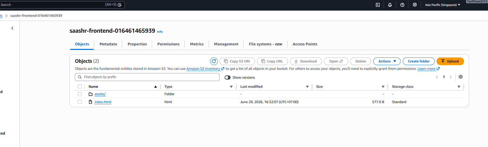

## Bước 12 — CloudFront

1. **CloudFront → Create distribution**:
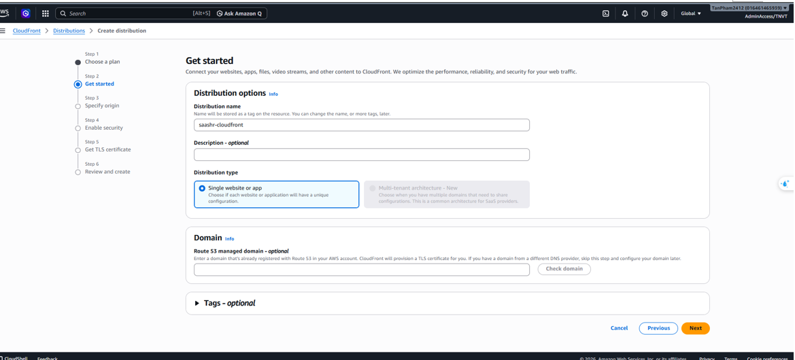
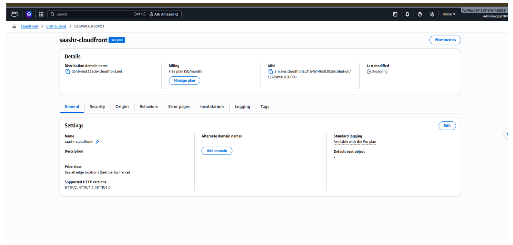
   - **Origin 1** = bucket S3 qua **OAC** — behavior mặc định `/*`.
   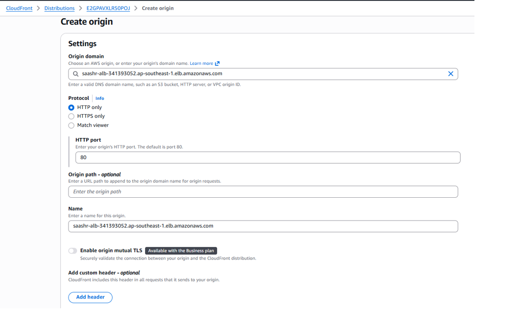
   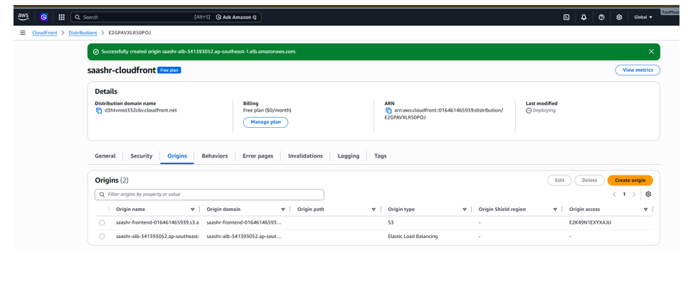

   - **Origin 2** = DNS của ALB — behavior `/api/v1/*`, forward hết header/cookie, tắt cache.
   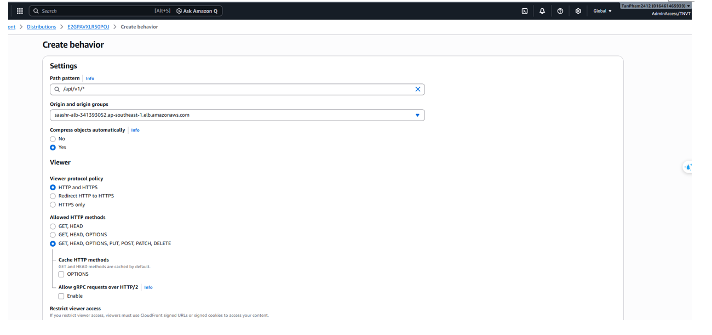
   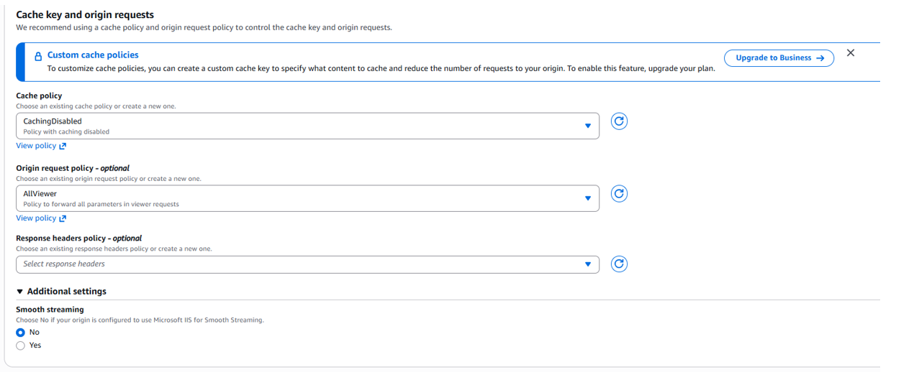
   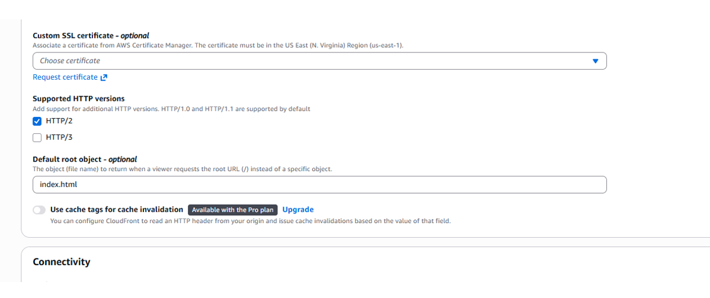
   - SPA error page: 403/404 → `/index.html` (200).
   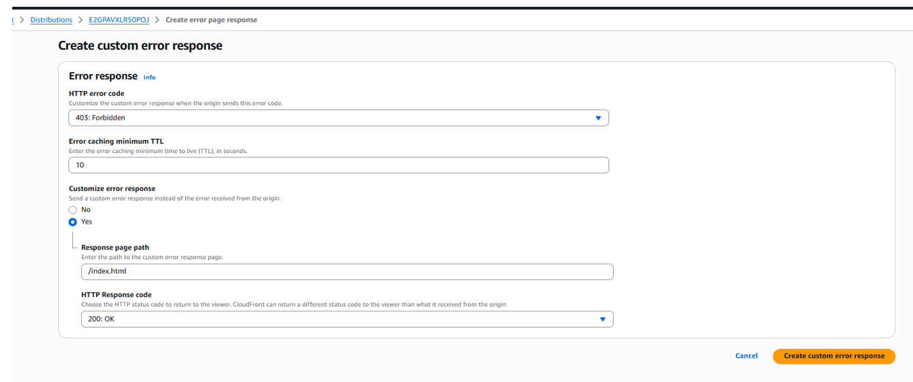
   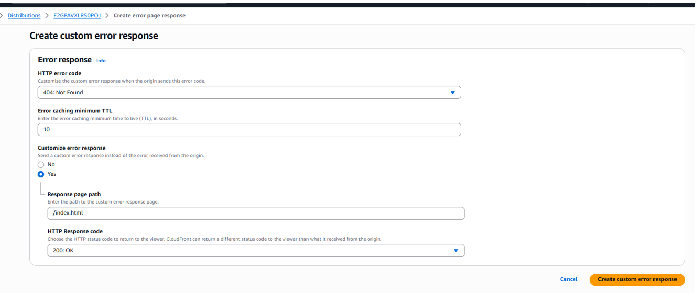
   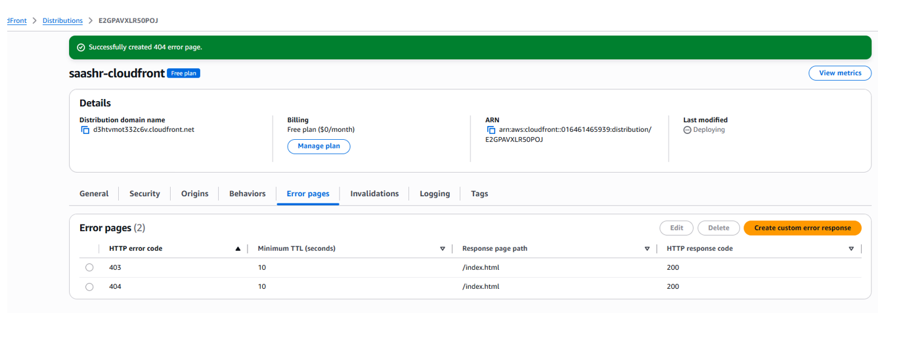
   - Create Invalidation
   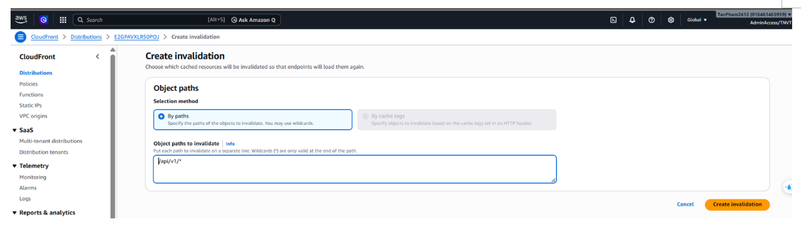
2. **Viewer certificate:** để demo, dùng **cert mặc định của CloudFront** và truy cập qua `https://d3htvmot332c6v.cloudfront.net/`.
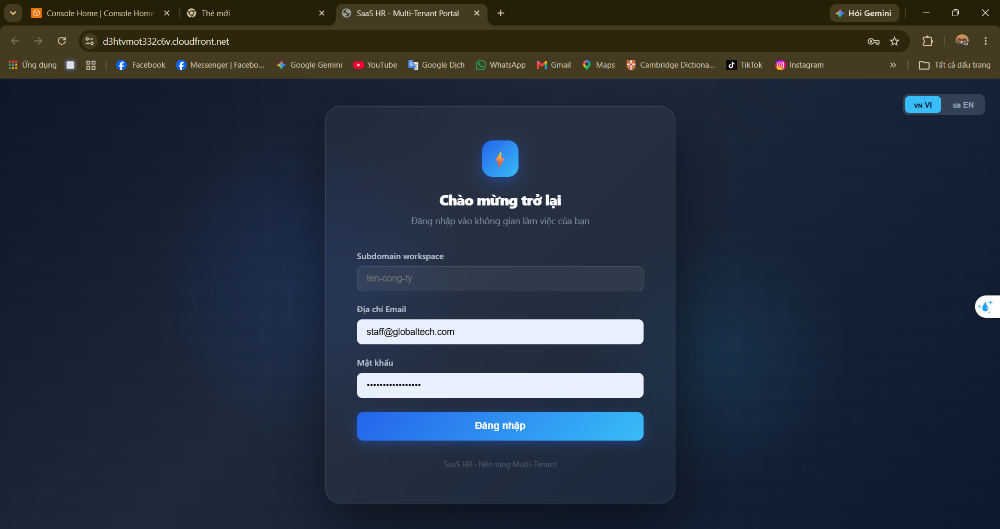
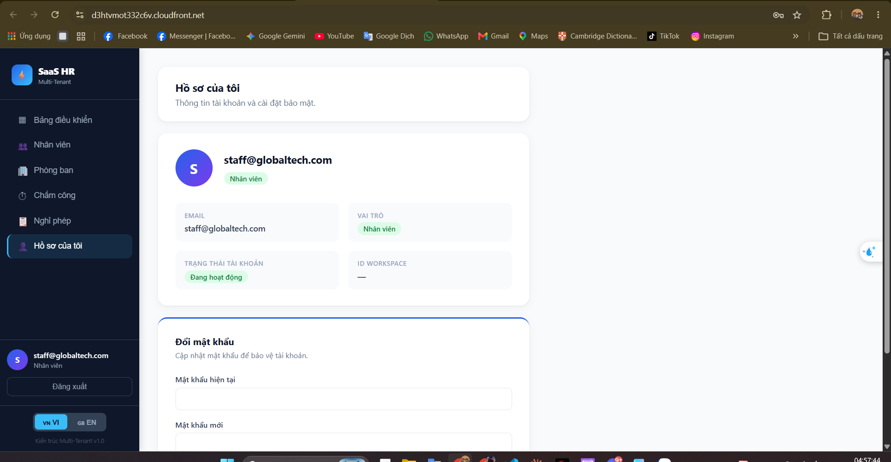
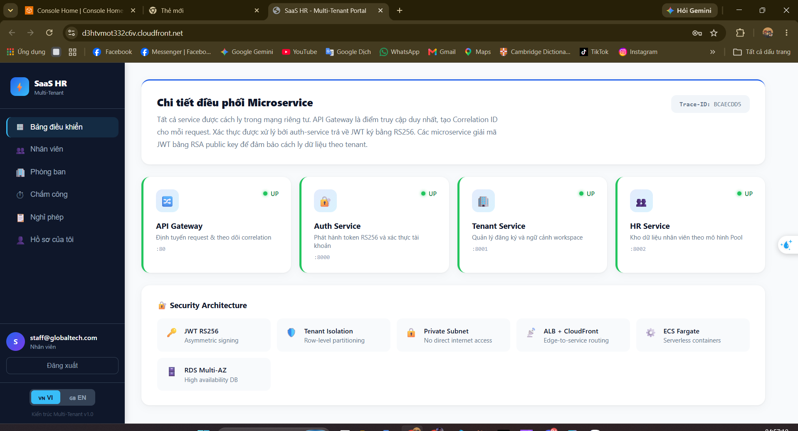


