---
title: "Giám sát & Cảnh báo"
date: 2026-07-08
weight: 8
chapter: false
pre: " <b> 5.8. </b> "
---

**Mục tiêu:** giám sát các ECS service — khi CPU Utilization của một service đạt **≥ 70%**, CloudWatch kích hoạt alarm và gửi email cho nhóm qua Amazon SNS.

## Bước 7 — Amazon SNS (topic + email subscription)

#### 7.1 Tạo SNS topic
**Amazon SNS → Topics → Create topic.**
- **Type:** Standard
- **Name:** `saashr-alerts`
- **Display name:** `saashr-alerts`
- Bấm **Create topic**.

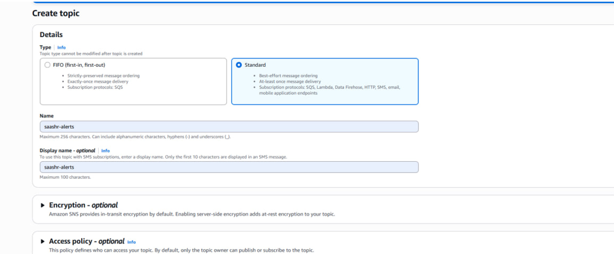

#### 7.2 Tạo email subscription
Mở topic `saashr-alerts` → tab **Subscriptions** → **Create subscription**.
- **Protocol:** Email
- **Endpoint:** `<team-email>`
- Bấm **Create subscription**.

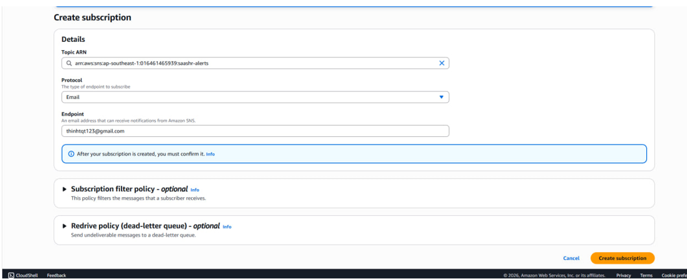

#### 7.3 Xác nhận email
Amazon SNS gửi một email xác nhận tới địa chỉ đó. Mở email và bấm **Confirm subscription**. Trạng thái chuyển từ **Pending confirmation** sang **Confirmed**.

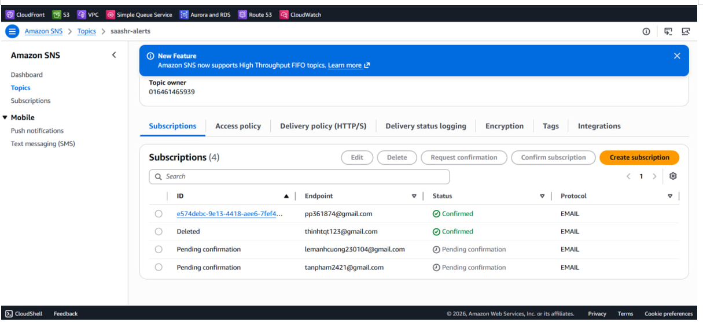

## Bước 13 — CloudWatch Alarm → SNS

#### 13.1 Tạo alarm → chọn metric
**CloudWatch → Alarms → Create alarm** → **Select metric**.

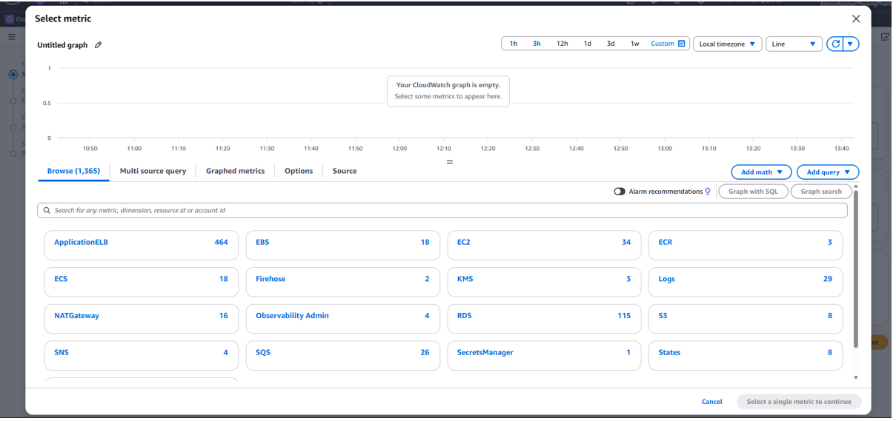

#### 13.2 Chọn metric ECS
Trong **Select metric**, đi theo **ECS → ClusterName, ServiceName**:
- **Cluster:** `saashr-cluster2`
- **Service:** `saashr-hr-svc`
- **Metric:** `CPUUtilization`
- Bấm **Select metric**.

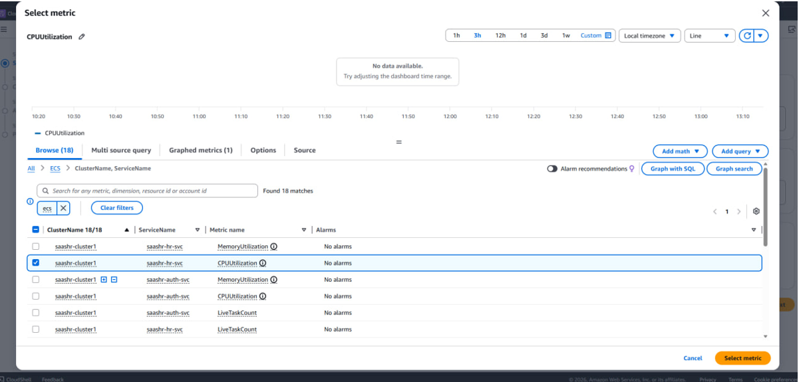

#### 13.3 Cấu hình điều kiện
- **Statistic:** Average
- **Period:** 1 minute
- **Threshold type:** Static
- **Whenever CPUUtilization is:** Greater/Equal
- **Threshold value:** `70`

Alarm chuyển sang trạng thái **ALARM** khi CPU Utilization ≥ 70% trong khoảng 1 phút.

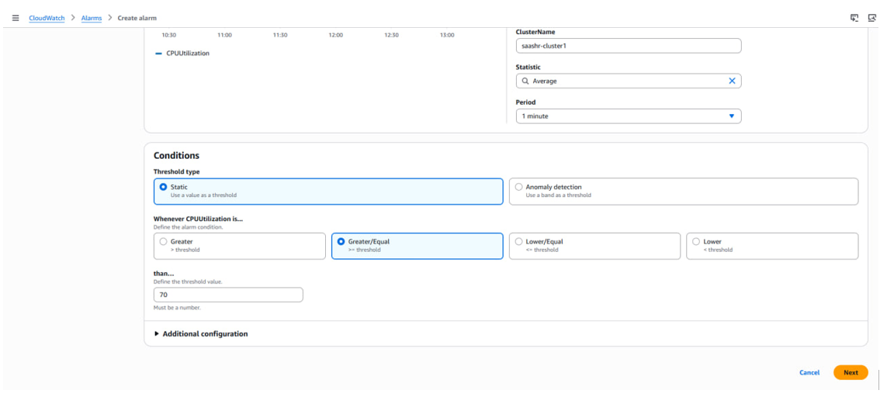

#### 13.4 Cấu hình action
- **Alarm state trigger:** In alarm
- **Notification → Select an existing SNS topic → `saashr-alerts`**

CloudWatch gửi email tới mọi subscriber đã xác nhận của topic khi alarm kích hoạt.

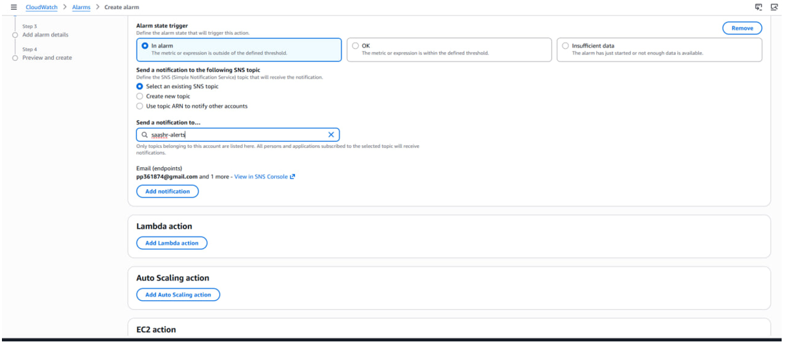

#### 13.5 Đặt tên alarm
- **Alarm name:** `saashr-alerts-alarm-noti` (thêm description nếu cần)
- Bấm **Next → Create alarm**.

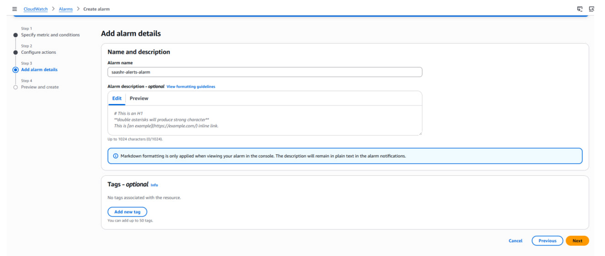

#### 13.6 Kiểm tra
Alarm mới hiện với:
- **Metric:** `CPUUtilization` · **Threshold:** ≥ 70% · **Action:** SNS Notification
- **State:** OK (hoặc **Insufficient data** lúc đầu)

Mở nó để xem đồ thị CPU Utilization, đường threshold, và lịch sử alarm.

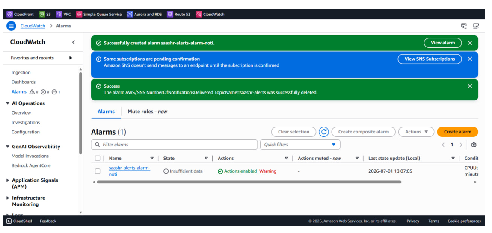

{}
Alarm này giám sát một service (`saashr-hr-svc`). Lặp lại 13.1–13.5 cho `auth` và `tenant` để phủ cả ba.
{}

#### Log
Mỗi service cũng đẩy log lên CloudWatch Logs group `/ecs/saashr/{service}` (cấu hình trong ECS task definition, Bước 10).

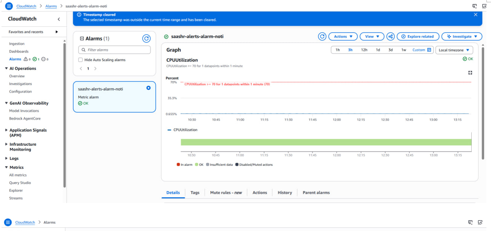
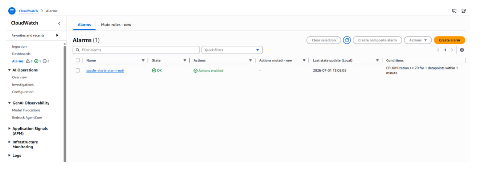

