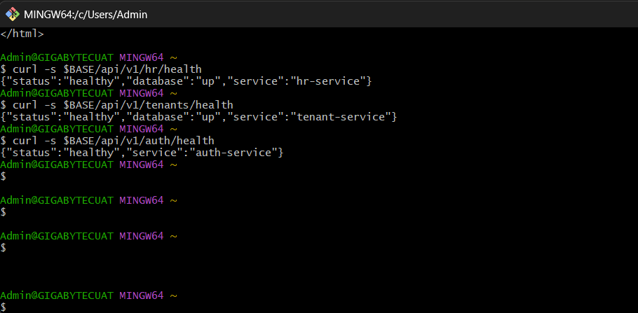
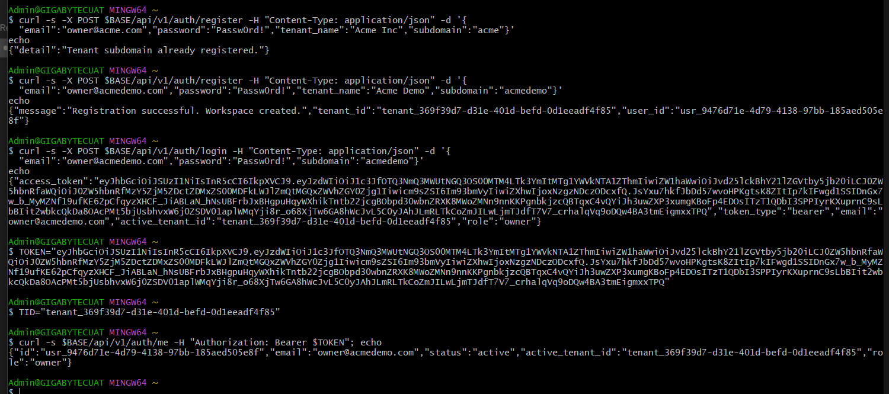
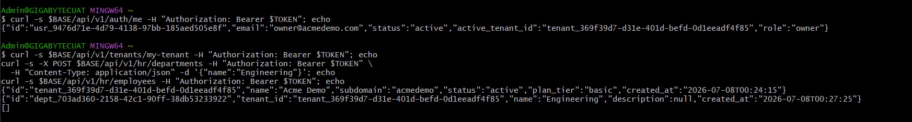
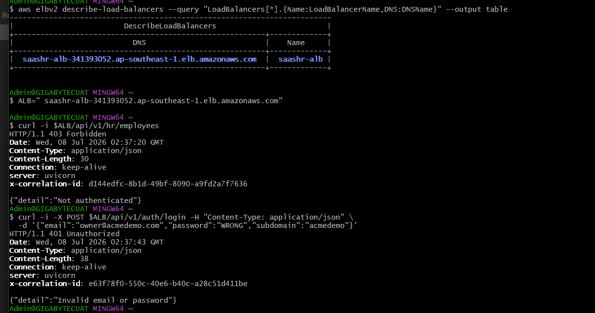
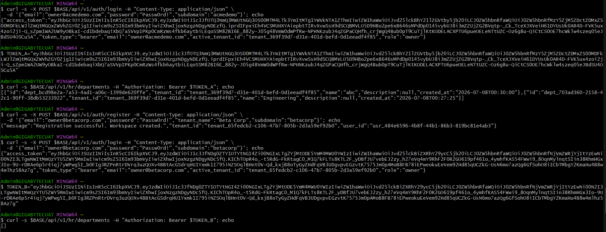
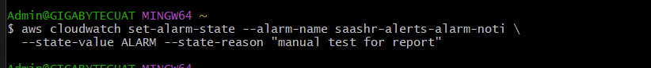
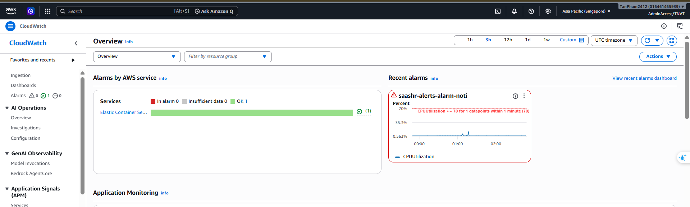
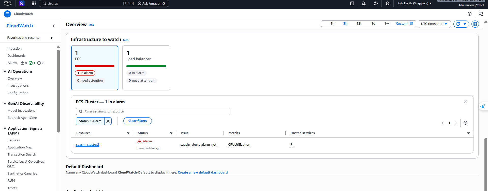

---
title: "Kiểm thử & Xác thực"
date: 2026-07-08
weight: 9
chapter: false
pre: " <b> 5.9. </b> "
---

Xác thực end-to-end stack đã triển khai qua cổng vào CloudFront, rồi kiểm thử lỗi, kiểm thử tính sẵn sàng cao, và quan sát (observability). Base URL:

```bash
BASE="https://d3htvmot332c6v.cloudfront.net/"   
```

## 1. Health check (smoke test)

```bash
curl -s $BASE/api/v1/auth/health
curl -s $BASE/api/v1/tenants/health
curl -s $BASE/api/v1/hr/health
```
**Kết quả — cả ba healthy (trường `database:up` xác nhận cả ECS *và* RDS đều tiếp cận được):**
```json
{"status":"healthy","service":"auth-service"}
{"status":"healthy","database":"up","service":"tenant-service"}
{"status":"healthy","database":"up","service":"hr-service"}
```



## 2. Phục vụ Frontend

```bash
curl -I $BASE/
```
**Kết quả:** `HTTP/2 200`, `content-type: text/html` — React SPA được phục vụ qua CloudFront (từ origin S3 riêng tư).


## 3. Xác thực — end-to-end

```bash
# Đăng ký workspace + owner
curl -s -X POST $BASE/api/v1/auth/register -H "Content-Type: application/json" \
  -d '{"email":"owner@acmedemo.com","password":"Passw0rd!","tenant_name":"Acme Demo","subdomain":"acmedemo"}'

# Đăng nhập → nhận access token
curl -s -X POST $BASE/api/v1/auth/login -H "Content-Type: application/json" \
  -d '{"email":"owner@acmedemo.com","password":"Passw0rd!","subdomain":"acmedemo"}'

# Kiểm tra token
curl -s $BASE/api/v1/auth/me -H "Authorization: Bearer $TOKEN"
```
**Kết quả — `/me` trả về danh tính đã xác thực với đúng role:**
```json
{"id":"usr_9476d71e-...","email":"owner@acmedemo.com","status":"active","active_tenant_id":"tenant_369f39d7-...","role":"owner"}
```
Token là **JWT RS256 tự ký của ứng dụng** (auth-service ký bằng private key; các service khác verify bằng public key — xem [Dữ liệu & Danh tính](../5.4-Data-Identity/)). Các claim (`tenant_id`, `role`) chi phối mọi kiểm tra phân quyền phía sau.



## 4. Nghiệp vụ (có xác thực, giới hạn theo tenant)

```bash
curl -s $BASE/api/v1/tenants/my-tenant -H "Authorization: Bearer $TOKEN"
curl -s -X POST $BASE/api/v1/hr/departments -H "Authorization: Bearer $TOKEN" \
  -H "Content-Type: application/json" -d '{"name":"Engineering"}'
curl -s $BASE/api/v1/hr/employees -H "Authorization: Bearer $TOKEN"
```
**Kết quả:**
```json
{"id":"tenant_369f39d7-...","name":"Acme Demo","subdomain":"acmedemo","status":"active","plan_tier":"basic","created_at":"2026-07-08T00:24:15"}
{"id":"dept_bcd98e2a-...","tenant_id":"tenant_369f39d7-...","name":"Engineering","description":null,"created_at":"2026-07-08T00:27:25"}
[]
```
Đọc tenant, tạo phòng ban (`201`), và liệt kê nhân viên (rỗng với tenant mới) đều thành công — đọc/ghi dữ liệu tới RDS chạy thông qua đường có xác thực.



## 5. Kiểm định & kiểm thử lỗi
{}
Các phản hồi lỗi của API được test **trực tiếp vào ALB** (`http://<alb-dns>/...`). Custom error response cho SPA của CloudFront map `403/404` thành `index.html` (`200`), che mất mã lỗi API với client trình duyệt — nên tầng API được kiểm định tại ALB, nơi `server: uvicorn` xác nhận request đã tới ứng dụng.
{}

| Kiểm thử | Lệnh | Kết quả quan sát |
|:--|:--|:--|
| Không token | `curl -i $ALB/api/v1/hr/employees` | **`403 Forbidden`** `{"detail":"Not authenticated"}` ✅ |
| Sai mật khẩu | đăng nhập với mật khẩu sai | **`401 Unauthorized`** `{"detail":"Invalid email or password"}` ✅ |
| Trùng subdomain | đăng ký subdomain đã tồn tại | **`409`** `{"detail":"Tenant subdomain already registered."}` ✅ |
| Trùng phòng ban | tạo phòng ban trùng tên | Bị chặn bởi unique constraint `uq_tenant_dept` của DB (xem ghi chú) |
| Cách ly tenant | đăng ký tenant **B**, đăng nhập B, `GET /api/v1/hr/employees` | Chỉ trả về dữ liệu **của B** — bản ghi của A không bao giờ thấy |

**Quan sát — trùng subdomain bị từ chối:**
```json
{"detail":"Tenant subdomain already registered."}
```

{}
**Hạn chế đã biết:** tạo phòng ban trùng tên được chặn đúng ở tầng database (unique key `uq_tenant_dept`), nhưng API hiện trả về **HTTP 500** thay vì **409 Conflict** cho gọn. Toàn vẹn dữ liệu vẫn an toàn; chỉ cần cải thiện phản hồi lỗi.
{}




## 6. Nhắn tin bất đồng bộ (SQS) — phát hiện khi kiểm thử

Kiểm thử end-to-end luồng bất đồng bộ (đổi status tenant → SQS → hr-service) đã lộ ra một **vấn đề tích hợp trong bản triển khai hiện tại** — đúng thứ mà giai đoạn kiểm thử này cần phát hiện:

- **Hạ tầng khỏe** — một message gửi tay vào `saashr-events` được chấp nhận (metric *NumberOfMessagesSent* / *SentMessageSize* tăng), xác nhận queue và DLQ đã tạo đúng.
- **Producer** — `tenant-service` **không** publish vào queue khi đổi status (không có *MessagesSent* từ ứng dụng), dù task role có `sqs:SendMessage`.
- **Consumer** — message test trong queue **không được tiêu thụ** (`MessagesVisible = 1`, `MessagesDeleted = 0`), tức consumer không xử lý trong lúc test.

**Đánh giá:** **thiết kế** hướng sự kiện (SQS decoupling + DLQ + consumer long-poll, xem [Hàng đợi bất đồng bộ](../5.5-Async-SQS/)) là đúng đắn; chỗ thiếu nằm ở phần đấu nối khi triển khai (nhiều khả năng image service cũ và/hoặc consumer chưa khởi động), và đang được sửa. Ghi lại đây như một phát hiện kiểm thử trung thực, không tuyên bố là đã đạt.


## 7. Quan sát (Observability)

- **Log:** các CloudWatch Logs group `/ecs/saashr-auth`, `/ecs/saashr-tenant`, `/ecs/saashr-hr` ghi log request và lỗi chưa xử lý.
- **Metric:** CloudWatch → ECS `CPUUtilization` cho từng service.
- **Cảnh báo → email:** kích hoạt alarm mà không cần tạo tải thật:
  ```bash
  aws cloudwatch set-alarm-state --alarm-name saashr-alerts-alarm-noti \
    --state-value ALARM --state-reason "manual test"
  ```
  **Mong đợi:** email SNS tới trong vài giây và alarm hiện trạng thái **ALARM** (xem [Giám sát & Cảnh báo](../5.8-Monitoring/)).








